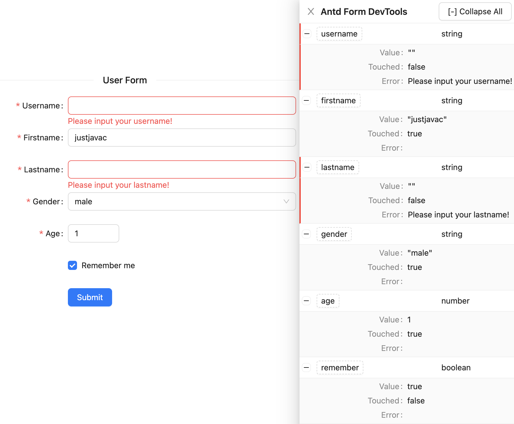

# DevTools for Ant Design Forms

[](https://github.com/justjavac/antd-form-devtools/actions/workflows/main.yml)
[![npm][npm]][npm-url]
[![download][download]][download-url]

A Powerfull DevTools to help debug Ant Design Forms.



## Install

```bash
npm install antd-form-devtools -D
```

## Usage

```diff
import React from 'react';
import { Button, Form, Input, InputNumber } from 'antd';
import { DevTool } from 'antd-form-devtools';

const App = () => {
  return (
    <>
      <Form name="userinfo" onFinish={console.log}>
        <Form.Item label="Username" name="username">
          <Input />
        </Form.Item>

        <Form.Item label="Age" name="age">
          <InputNumber min="0" max="100" />
        </Form.Item>

        <Form.Item>
          <Button type="primary" htmlType="submit">
            Submit
          </Button>
        </Form.Item>

+       <DevTool />
      </Form>
    </>
  );
};

export default App;
```

## Live Demo

https://antd-form-devtools.vercel.app

## Local example

```bash
git clone https://github.com/justjavac/antd-form-devtools.git
cd example
yarn dev
```

## License

[antd-form-devtools](https://github.com/justjavac/antd-form-devtools) is
released under the MIT License. See the [LICENSE](LICENSE) file in the project
root directory for details.

# Thank

♥️ The inspiration for this project comes from [react-hook-form/devtools](https://github.com/react-hook-form/devtools).

[npm]: https://img.shields.io/npm/v/antd-form-devtools.svg
[npm-url]: https://npmjs.com/package/antd-form-devtools
[download]: https://img.shields.io/npm/dm/antd-form-devtools.svg?style=flat
[download-url]: https://npmcharts.com/compare/antd-form-devtools?minimal=true
